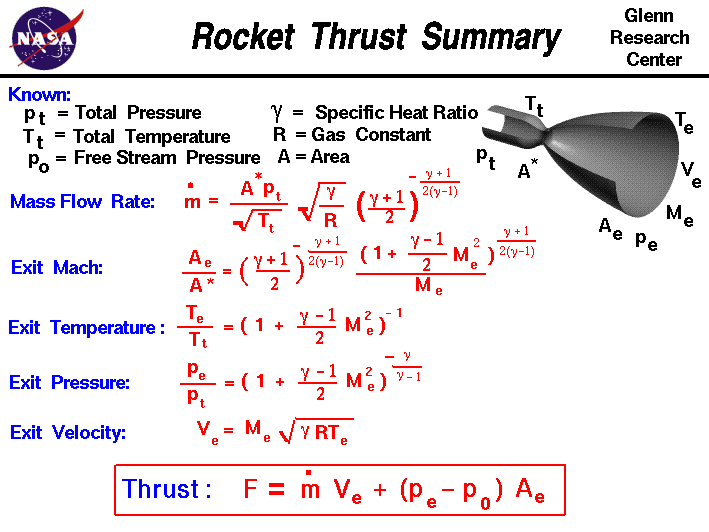

## Rocket Thrust Summary

Source: [NASA](https://www.grc.nasa.gov/WWW/BGH/rktthsum.html)

### Known Parameters:
- **pt** = Total Pressure
- **Tt** = Total Temperature
- **p0** = Free Stream Pressure
- **A*** = Throat Area
- **Ae** = Exit Area
- **&gamma;** = Specific Heat Ratio
- **R** = Gas Constant

### Calculated Parameters:
- **Me** = Exit Mach Number
- **Te** = Exit Temperature
- **pe** = Exit Pressure
- **Ve** = Exit Velocity
- **&dot;m** = Mass Flow Rate
- **F** = Thrust

### Key Equations:

#### Mass Flow Rate:
$$
\dot{m} = \frac{A^* p_t}{\sqrt{T_t}} \sqrt{\frac{\gamma}{R}} \left( \frac{\gamma + 1}{2} \right)^{-\frac{\gamma + 1}{2(\gamma - 1)}}
$$

#### Exit Mach Number:
$$
\frac{A_e}{A^*} = \left( \frac{\gamma + 1}{2} \right)^{-\frac{\gamma + 1}{2(\gamma - 1)}} \frac{\left(1 + \frac{\gamma - 1}{2} M_e^2 \right)^{\frac{\gamma + 1}{2(\gamma - 1)}}}{M_e} 
$$

#### Exit Temperature:
$$
\frac{T_e}{T_t} = \left( 1 + \frac{\gamma - 1}{2} M_e^2 \right)^{-1}
$$

#### Exit Pressure:
$$
\frac{p_e}{p_t} = \left( 1 + \frac{\gamma - 1}{2} M_e^2 \right)^{\frac{-\gamma}{\gamma - 1}}
$$

#### Exit Velocity:
$$
V_e = M_e \sqrt{\gamma R T_e}
$$

#### Thrust:
$$
F = \dot{m} V_e + (p_e - p_0) A_e
$$

[Rocket Engine Calculation](https://htmlpreview.github.io/?https://github.com/rezamarzban/thrust/blob/main/rocket_numerical.html)

## Input Fuel and Oxidizer

**Input Mass Flow Rate = Output Mass Flow Rate**

So:

**$\dot{m}$** = **$\dot{m}_{fuel}$** + **$\dot{m}_{oxidizer}$**

Where:
- **$\dot{m}$** is the Mass Flow Rate
- **$\dot{m}_{oxidizer}$** is the Mass Flow Rate of the oxidizer.
- **$\dot{m}_{fuel}$** is the Mass Flow Rate of the fuel.

Few people truly understand this simple rule. In a rocket, the input mass flow rate refers to the rate at which propellant is consumed and burned in the combustion chamber. The output mass flow rate is the rate at which exhaust gases are expelled through the nozzle. According to the conservation of mass, the input and output mass flow rates are equal, ensuring steady propulsion. This expelled mass creates thrust, propelling the rocket forward by Newton's third law of motion.

In rocket propulsion, the **oxidizer-to-fuel ratio (O/F)** is a critical parameter that defines the mass ratio between the oxidizer and the fuel. It determines the efficiency and performance of the combustion process. A proper balance of oxidizer and fuel ensures optimal combustion, providing the maximum thrust.

The **O/F ratio** is mathematically expressed as:

$$
\text{O/F} = \frac{m_{oxidizer}}{m_{fuel}}
$$

A higher O/F ratio means more oxidizer is used relative to fuel, and vice versa. Different rocket engines are optimized for specific O/F ratios based on the desired performance and fuel efficiency.

**Typical Oxidizer-to-Fuel Ratios (O/F)**

The table below lists the typical oxidizer-to-fuel ratios (O/F) for common rocket propellants:

| **Oxidizer**          | **Fuel**            | **O/F Ratio** (by mass) |
|-----------------------|---------------------|-------------------------|
| Liquid Oxygen (LOX)    | Liquid Hydrogen (LH2)| 5.5 - 6.0               |
| Liquid Oxygen (LOX)    | RP-1 (Kerosene)     | 2.56                    |
| Nitrogen Tetroxide (N2O4) | Hydrazine (N2H4)  | 1.6 - 2.0               |
| Nitrogen Tetroxide (N2O4) | UDMH             | 2.0 - 2.2               |
| Hydrogen Peroxide (H2O2) | Kerosene          | 7.0                     |
| Fluorine (F2)          | Liquid Hydrogen (LH2)| 4.0 - 4.5               |

The oxidizer-to-fuel ratio (O/F) is crucial for optimizing the combustion process in rocket engines. Each propellant combination has its own optimal O/F ratio to achieve maximum efficiency and thrust.

For other fuel and oxidizer combinations, the chemical stoichiometry must be determined. For example stoichiometry for LPG and liquid oxygen:

**Stoichiometry for LPG and Liquid Oxygen**

For the combustion of **Liquefied Petroleum Gas (LPG)**, which we will assume to be primarily **propane (C₃H₈)**, with **liquid oxygen (LOX)**, the stoichiometry can be solved as follows:

**Combustion Reaction**
The complete combustion of propane with oxygen is represented by the balanced chemical equation:

$$
\text{C}_3\text{H}_8 + 5\text{O}_2 \rightarrow 3\text{CO}_2 + 4\text{H}_2\text{O}
$$

**Mole Ratio**

From the balanced equation, 1 mole of propane reacts with 5 moles of oxygen.

**Mass Calculation**

To determine the mass of oxygen required to burn 1 mole of propane:

- Molar mass of propane **$\(\text{C}_3\text{H}_8\)$**:

$$
(3 \times 12) + (8 \times 1) = 44 \, \text{g/mol}
$$

- Molar mass of oxygen **$(\text{O}_2\)$**:

$$
2 \times 16 = 32 \, \text{g/mol}
$$

Thus, 1 mole of propane (44 g) requires 5 moles of oxygen, which is:

$$
5 \times 32 = 160 \, \text{g of oxygen}
$$

**Oxidizer-to-Fuel Ratio (O/F)**

The oxidizer-to-fuel ratio by mass is:

$$
\text{O/F} = \frac{\text{Mass of oxygen}}{\text{Mass of propane}} = \frac{160}{44} \approx 3.64
$$

Therefore, the **O/F ratio** for the combustion of propane with liquid oxygen is approximately **3.64** by mass.

This process can be applied to other components of LPG, like butane, by balancing the chemical equation and calculating the mass ratios similarly.

**Oxidizer-to-Fuel Ratios (O/F) for Various Fuels**

The table below lists the typical oxidizer-to-fuel ratios (O/F) for different fuels when combined with liquid oxygen and air. The O/F ratio is given by mass.

**With Liquid Oxygen (LOX)**

| **Fuel**          | **O/F Ratio** (by mass) |
|-------------------|-------------------------|
| Gasoline (Octane) | 15.7                    |
| Diesel Oil        | 14.6                    |
| Ethanol           | 3.67                    |
| Methanol          | 4.3                     |
| Methane           | 3.5                     |
| LPG (Propane)     | 3.64                    |

## Tsiolkovsky Rocket Equation

The Tsiolkovsky rocket equation describes the relationship between the change in velocity (**$\Delta V$**) of a rocket and its mass, taking into account the specific impulse (**$I_{sp}$**) of the propulsion system. The equation is given by:

**$\Delta V = I_{sp} \cdot g_0 \cdot \ln\left(\frac{m_0}{m_f}\right)$**

### Variables Explained

- **$\Delta V$**: This is the total change in velocity that the rocket must achieve to complete its mission. It is a crucial parameter in spacecraft design and mission planning.
  
- **$I_{sp}$**: Specific impulse is a measure of how effectively a rocket uses propellant. It is defined as the thrust produced per unit weight flow rate of the propellant. Higher specific impulse values indicate more efficient engines. The units are usually seconds, and it can be calculated using:

  **$I_{sp} = \frac{T}{\dot{m} \cdot g_0}$**

  where:
  - **$T$** is the thrust produced by the engine,
  - **$\dot{m}$** is the mass flow rate of the propellant (the amount of propellant consumed per second),
  - **$g_0$** is the acceleration due to gravity at sea level (approximately **$9.81 \, \text{m/s}^2$**).
  
- **$g_0$**: This is the standard acceleration due to gravity, which provides a reference point for comparing thrust to weight.

- **$m_0$**: This is the initial mass of the rocket, which includes the mass of the structure, payload, and fuel.

- **$m_f$**: This is the final mass of the rocket after the fuel has been burned.

### Rocket Propellant ISP Values

Below is a table of approximate specific impulse (ISP) values for common rocket propellants.

#### Liquid Propellant Rockets
| Propellant Combination            | ISP (Sea Level) | ISP (Vacuum) |
|-----------------------------------|-----------------|--------------|
| RP-1 / Liquid Oxygen (LOX)        | 270–300 s      | 310–350 s    |
| Liquid Hydrogen (LH2) / LOX       | 360–380 s      | 430–460 s    |
| MMH / N2O4                        | 250–290 s      | 300–330 s    |
| UDMH / N2O4                       | 230–290 s      | 310–340 s    |
| Ethanol / LOX                     | 240–270 s      | 300–340 s    |
| Kerosene / H2O2                   | 200–300 s      | 250–320 s    |
| Hydrazine / H2O2                  | 230–260 s      | 300–330 s    |

#### Solid Propellant Rockets
| Propellant Type                   | ISP (Sea Level) | ISP (Vacuum) |
|-----------------------------------|-----------------|--------------|
| Composite Propellants (e.g., HTPB/AP) | 230–265 s  | 280–300 s    |
| Double-Base Propellants           | 180–220 s      | 230–260 s    |
| Nitrate Esters                    | 170–210 s      | 220–250 s    |

#### Hybrid Rockets
| Oxidizer / Fuel                   | ISP (Sea Level) | ISP (Vacuum) |
|-----------------------------------|-----------------|--------------|
| N2O / HTPB                        | 200–250 s      | 250–320 s    |
| LOX / HTPB                        | 250–280 s      | 320–380 s    |

> **Note:** These ISP values are approximate and can vary depending on engine design, chamber pressure, and altitude.

### Typical Rockets ISP (vacuum) Table 

| Oxidizers / Fuels                     | Diborane (B2H6) | Triethylaluminum (TEA) | Lithium | Hydrazine (N2H4) | Monomethylhydrazine (MMH) | UDMH | Aluminum Powder | Magnesium Powder | Liquid Hydrogen (LH2) | Methane (CH4) | RP-1 (Refined Kerosene) | Gasoline | Diesel Fuel | Ethanol | Methanol | Propanol | LPG | PBAN | HTPB | APCP | Polyethylene | Sugar (Sucrose) |
|---------------------------------------|------------------|-------------------------|---------|------------------|----------------------------|------|------------------|------------------|------------------------|----------------|-------------------------|----------|-------------|---------|----------|----------|-----|------|------|------|--------------|------------------|
| **Fluorine (F2)**                     | 350-380          | 350-380                 | 360-390 | 340-370          | 340-370                    | 340  | 310              | 310              | 450                    | 400            | 300                     | 250      | 200         | 300     | 300      | 320      | 290 | 300  | 320  | 340  | 280          | 220              |
| **Chlorine Trifluoride (ClF3)**      | 380-390          | 380-390                 | 380-390 | 360-370          | 360-370                    | 360  | 340              | 340              | 460                    | 410            | 320                     | 260      | 210         | 310     | 310      | 330      | 300 | 310  | 330  | 350  | 290          | 230              |
| **Liquid Oxygen (LOX)**               | 350-400          | 350-400                 | 380-390 | 350-380          | 350-380                    | 350  | 330              | 330              | 450                    | 420            | 340                     | 270      | 220         | 320     | 320      | 340      | 310 | 320  | 340  | 360  | 300          | 240              |
| **Ozone (O3)**                        | 350-380          | 350-380                 | 360-390 | 340-370          | 340-370                    | 340  | 310              | 310              | 450                    | 400            | 300                     | 250      | 200         | 300     | 300      | 320      | 290 | 300  | 320  | 340  | 280          | 220              |
| **Nitrogen Tetroxide (N2O4)**        | 350-380          | 350-380                 | 360-390 | 340-370          | 340-370                    | 340  | 310              | 310              | 450                    | 400            | 300                     | 250      | 200         | 300     | 300      | 320      | 290 | 300  | 320  | 340  | 280          | 220              |
| **Ammonium Perchlorate (NH4ClO4)**  | 260-350          | 260-350                 | 310-340 | 310-330          | 310-330                    | 310  | 290              | 280              | 410                    | 370            | 290                     | 240      | 190         | 290     | 290      | 310      | 280 | 290  | 310  | 330  | 270          | 210              |
| **Hydrogen Peroxide (H2O2)**         | 250-310          | 250-310                 | 290-310 | 280-300          | 280-300                    | 280  | 270              | 260              | 400                    | 360            | 280                     | 230      | 180         | 270     | 270      | 290      | 260 | 270  | 290  | 310  | 250          | 200              |
| **Nitrous Oxide (N2O)**               | 250-330          | 250-330                 | 300-330 | 290-310          | 290-310                    | 290  | 280              | 270              | 410                    | 370            | 290                     | 240      | 190         | 280     | 280      | 300      | 270 | 280  | 300  | 320  | 260          | 210              |
| **Nitric Acid (HNO3)**                | 250-330          | 250-330                 | 300-330 | 290-310          | 290-310                    | 290  | 280              | 270              | 410                    | 370            | 290                     | 240      | 190         | 280     | 280      | 300      | 270 | 280  | 300  | 320  | 260          | 210              |
| **Ammonium Nitrate (NH4NO3)**        | 250-330          | 250-330                 | 300-330 | 290-310          | 290-310                    | 290  | 280              | 270              | 410                    | 370            | 290                     | 240      | 190         | 280     | 280      | 300      | 270 | 280  | 300  | 320  | 260          | 210              |
| **Potassium Chlorate (KClO3)**       | 250-350          | 250-350                 | 320-350 | 310-320          | 310-320                    | 310  | 290              | 280              | 420                    | 370            | 290                     | 240      | 190         | 280     | 280      | 300      | 270 | 280  | 300  | 320  | 260          | 210              |
| **Sodium Chlorate (NaClO3)**         | 250-350          | 250-350                 | 320-350 | 310-320          | 310-320                    | 310  | 290              | 280              | 420                    | 370            | 290                     | 240      | 190         | 280     | 280      | 300      | 270 | 280  | 300  | 320  | 260          | 210              |
| **Potassium Nitrate (KNO3)**         | 250-340          | 250-340                 | 310-340 | 310-320          | 310-320                    | 310  | 290              | 280              | 400                    | 360            | 280                     | 230      | 180         | 270     | 270      | 290      | 260 | 270  | 290  | 310  | 250          | 200              |
| **Sodium Nitrate (NaNO3)**           | 250-340          | 250-340                 | 310-340 | 310-320          | 310-320                    | 310  | 290              | 280              | 400                    | 360            | 280                     | 230      | 180         | 270     | 270      | 290      | 260 | 270  | 290  | 310  | 250          | 200              |

[Here](https://htmlpreview.github.io/?https://github.com/rezamarzban/thrust/blob/main/rocketsISP_visual.html) is live view and interactive version of this table.

### Calculating Fuel Mass

To find the mass of the fuel (and oxidizer) required for the mission, you can rearrange the equation:

**$m_{\text{fuel}} = m_0 - m_f$**

The **$m_f$** can be determined from the rocket equation by expressing it in terms of **$\Delta V$**:

1. Rearrange the Tsiolkovsky equation to find **$m_f$**:
   **$\frac{m_0}{m_f} = e^{\frac{\Delta V}{I_{sp} \cdot g_0}}$**
   **$m_f = \frac{m_0}{e^{\frac{\Delta V}{I_{sp} \cdot g_0}}}$**

2. Substitute **$m_f$** back into the equation for fuel mass:
   **$m_{\text{fuel}} = m_0 - \frac{m_0}{e^{\frac{\Delta V}{I_{sp} \cdot g_0}}}$**
   **$m_{\text{fuel}} = m_0 \left(1 - \frac{1}{e^{\frac{\Delta V}{I_{sp} \cdot g_0}}}\right)$**

This expression allows you to calculate the amount of fuel (and oxidizer) needed based on the desired **$\Delta V$**, the specific impulse of the rocket's propulsion system, and the initial mass of the rocket. If you have specific values for these parameters, you can substitute them into the formula to find the required fuel (and oxidizer) mass.

[Tsiolkovsky Rocket Equation Calculator](https://htmlpreview.github.io/?https://github.com/rezamarzban/thrust/blob/main/tsiolkovsky.html)

## Used Programming Languages 

- **C++**: A general-purpose programming language with object-oriented features, widely used for system/software development.
- **Fortran**: A language focused on numerical and scientific computing, known for its performance in mathematical calculations.
- **HTML**: A markup language used for creating and structuring web pages and web applications.
- **Kotlin**: A statically-typed language used primarily for Android development, known for its modern features and interoperability with Java.
- **MATLAB**: A high-level language and environment for numerical computing, visualization, and programming.
- **Pascal**: A procedural programming language designed for teaching programming and structured programming.
- **PHP**: A server-side scripting language used for web development and creating dynamic web pages.
- **Python**: A versatile, high-level programming language known for its readability and ease of use in various domains, including web development, data analysis, and artificial intelligence.
